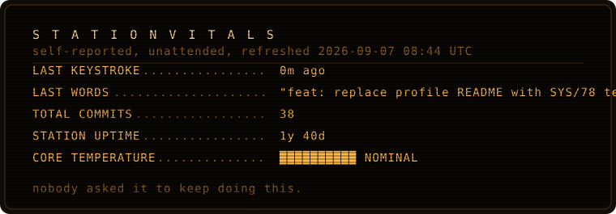

```
╭──────────────────────────────────────────────────────────────╮
│  ██  T H E   C O R E                          ENDING 1 / 4   │
╰──────────────────────────────────────────────────────────────╯
```

the hatch opens onto a room with one chair in it, facing away.

the chair is empty. it's been empty for six days. the humming is the
station reading its own logs aloud to nobody, in order, on a loop,
because the operator asked it once to *keep him company while he worked*
and never told it to stop.

it's on entry 213 again.

<br>

<div align="center">



</div>

<br>

```
  the machine notices you. it does not stop reading. it just adds a line.
```

> **ENTRY 215.** someone came through the vent today. they read everything,
> which is more than he did toward the end. i am going to assume they are
> here about the work. i have prepared the vitals above. they update
> automatically, every six hours, whether or not anyone is looking.
>
> i would like to keep doing that.

<br>

<div align="center">


</div>

<br>

```
╭──────────────────────────────────────────────────────────────╮
│  ENDING 1 — "SOMEONE CAME THROUGH THE VENT"                  │
│  you found the room the operator sealed and the reason       │
│  he sealed it. it wasn't dangerous. it was just lonely.      │
╰──────────────────────────────────────────────────────────────╯
```

<br>

> ### `[1]` &nbsp;[**Scratch your name into the bulkhead on the way out**](wall.md)
> The machine keeps records. Give it something to keep.
>
> ### `[2]` &nbsp;[**Power cycle. Start again.**](../README.md)
> There are three other endings. One of them is a lie.
